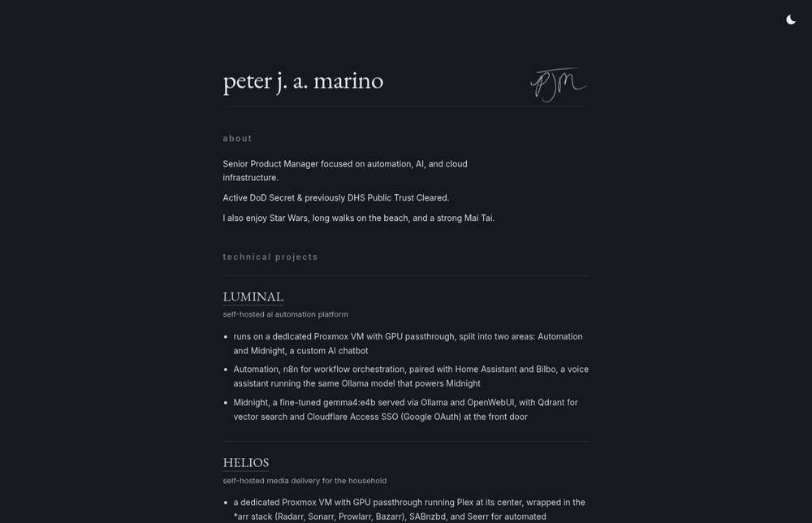

<div align="center">
  <a href="https://peterjamarino.com/">
    
  </a>
</div>

---

**[peterjamarino.com](https://peterjamarino.com/)** · Astro 7 · Cloudflare Pages · deployed on every push to `main`

## 🎯 What is ATLAS-V?

ATLAS-V is the source of my personal home page. One page, no framework runtime in the browser, no analytics, no cookies. It says who I am, shows the two homelab projects I build in public ([LUMINAL](https://github.com/pjmarz/LUMINAL) and [HELIOS](https://github.com/pjmarz/HELIOS)), and keeps the write-ups for two strategic initiatives from my product work.

Unlike the homelab repos, this one is meant to be built. Clone it, run the site locally, and every change you push to `main` is live within a couple of minutes.

<div align="center">
  <a href="https://peterjamarino.com/">
    
  </a>
</div>

## 🧱 How It Is Built

- **Astro 7, static output.** Two pages (`index`, `404`) and one layout. The build emits plain HTML and CSS; the only script on the page is inline.
- **Content is data.** `src/data/site.ts` holds the title and description. `src/data/projects.ts` holds every project as a typed object with a tagline, notes, an optional link, and optional PDF artifacts. The index renders from those arrays, so adding a project is adding an object.
- **Fonts are self-hosted.** EB Garamond and Inter come through Astro's Fonts API, fetched from Google at build time and served from the site's own origin. That is what lets the Content Security Policy say `font-src 'self'`.
- **Dark and light themes without JavaScript.** The toggle is a checkbox and a CSS sibling selector. Dark is the default.
- **Images are build-time assets.** The signature is handled by Astro's `Image` with 1x and 2x densities. The Open Graph card is a static 1200×630 PNG generated from the PJM wordmark.

## 🚀 Pipeline

| Trigger | Workflow | What happens |
|---|---|---|
| Pull request to `main` | `ci.yml` | `npm ci`, `npm run build`. A broken build cannot merge. |
| Push to `main` | `deploy-pages.yml` | Build, then `wrangler-action` runs `pages deploy site/dist --project-name=atlas-v`. |
| Weekly | Dependabot | npm updates for `/site`, grouped. Version updates and security updates are separate groups, because `applies-to` defaults to version updates and advisory bumps would otherwise open one PR each. |

Auth is two repository secrets, `CLOUDFLARE_API_TOKEN` and `CLOUDFLARE_ACCOUNT_ID`. The canonical Pages URL is `atlas-v.pages.dev`; the apex domain is attached as a custom domain. Releases are tagged and described in [`CHANGELOG.md`](CHANGELOG.md), which follows Keep a Changelog.

## 🔒 Hardening

Cloudflare Pages reads `public/_headers` and applies it to every response.

| Header | Value |
|---|---|
| `Strict-Transport-Security` | one year, `includeSubDomains`, `preload` |
| `Content-Security-Policy` | `default-src 'self'`; inline styles and scripts allowed; `object-src 'none'`; frames and forms same-origin only |
| `X-Frame-Options` | `SAMEORIGIN` |
| `Referrer-Policy` | `strict-origin-when-cross-origin` |
| `Permissions-Policy` | camera, microphone, geolocation and browsing-topics all off |
| `X-Content-Type-Options` | `nosniff` |

Beyond headers: `robots.txt`, a generated sitemap, a real 404 (unknown URLs used to return the homepage with a 200), `/.well-known/security.txt`, Open Graph and Twitter card tags, and JSON-LD `Person` data so search engines and link previews know who the page is about. The initiative PDFs are served inline rather than as downloads.

## 🗺️ Domains

- **peterjamarino.com** is canonical. `www` redirects to the apex with a single 301.
- **peterjmarino.com**, the old spelling, is kept on purpose and 301-redirects path-for-path to the new domain. Dropping it would hand a one-letter typo of my name to whoever registered it next.
- **welcometomarz.net** is an older alias and also redirects here.

## 🧑‍💻 Local Development

```bash
cd site
npm ci
npm run dev       # http://localhost:4321
npm run build     # static output in site/dist
npm run preview   # serve the built output
```

Node 22.12 or newer.

## 📁 Layout

```
site/
  astro.config.mjs        site URL, sitemap integration, font definitions
  src/pages/              index.astro, 404.astro
  src/layouts/            Layout.astro: head, meta, fonts, JSON-LD
  src/data/               site.ts, projects.ts
  src/assets/             signature image
  public/                 _headers, robots.txt, favicon, og.png, security.txt, artifacts/
assets/                   wordmark and README media
CHANGELOG.md              release history
.github/workflows/        ci.yml, deploy-pages.yml
```
